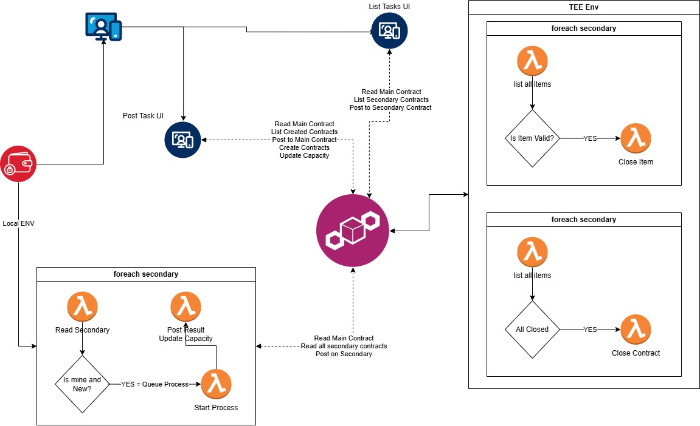

# Wiki

## Terminology

|          **Name**         	|                                           **Meaning**                                           	|        **Value**       	|
|:-------------------------:	|:-----------------------------------------------------------------------------------------------:	|:----------------------:	|
|        GRACE_PERIOD       	|                       How much the validator waits before doing operations                      	|          5 min         	|
|    ContractName_CLOSED    	|                    The contract has been closed, needs to be validated by TEE                   	|        Validated       	|
| ItemName_CLOSED_VALIDATED 	|                     The item "ItemName" has been validated by a TEE process                     	|        Validated       	|
|      ItemName_QUEUED      	|        The item is being processed by the wallet owner of the one that posted the message       	|      Wallet Owner      	|
|      ItemName_CLOSED      	|         The item was closed by the wallet owner, needs to append the output of the task         	| The output of the task 	|
|       ItemName.LEVEL      	|                                      The level of the item                                      	|    LOW, MID or HIGH    	|
|       ItemName.ALIAS      	|                            The name of the item, used for displaying                            	|        ItemName        	|
|       ItemName.SETUP      	|                           The task that needs to be RAN for this item                           	|          JSON          	|
|      ItemName.REWARD      	| The ammoun of *SomeCurrency* that will be sent to the wallet of the one that fullfils this Item 	|         Number         	|
|      ItemName.MAX_RUN     	|                        How much we wait before making the task open again                       	|       In minutes       	|

## Business logic

x is **ItemName**

A pair can only be validated for a period of 4 * **GRACE_PERIOD**:
- A valid pair is (x, **x_CLOSED**) where **x_CLOSED** has a timestamp, by the same wallet, at most x.MAX_RUN + GRACE_PERIOD later than **x_QUEUED**
- We wait a GRACE_PERIOD in case a pair of (**x_CLOSED**, **x_CLOSED_VALIDATING**) exists = NO OVERLAP

A **CONTRACT** is valid if it has been signed by us (they are signed by the FE).

An **Item** (identified by **ItemName**, x) is OPEN if:
- N0 **x_CLOSED_VALIDATED** exists
- IF **x_CLOSED_VALIDATING** exists, TIME_DIFF(**NOW**, Latest(**x_CLOSED_VALIDATING**)) > 4 * **GRACE_PERIOD**
- IF **x_QUEUED** exists: TIME_DIFF(**NOW**, Latest(**x_QUEUED**)) > **x**.MAX_RUN + **GRACE_PERIOD**

Validating a task:
- pull **ItemName.SETUP**
- run the validation part for the setup
- 